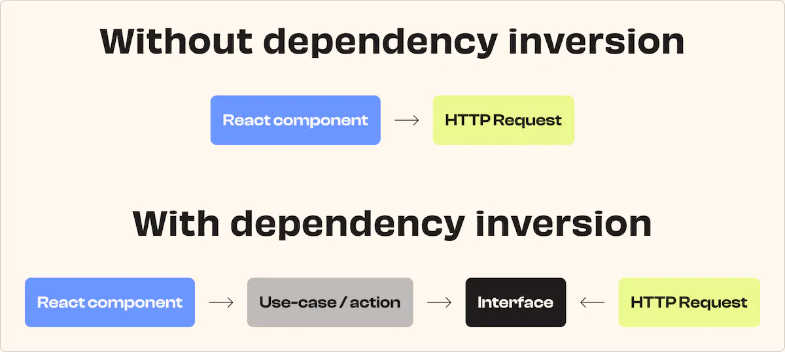

# Dependency inversion in front-end with React & Next.js

This example shows how to use dependency inversion in front-end with React & Next.js.
I only use simple object & React Context to demonstrate the concept. If you use Redux, React-Query or other libraries, you can apply the same concept.

## Language & Librairies
- [React](https://reactjs.org/)
- [Next.js](https://nextjs.org/) (app directory)
- [TypeScript](https://www.typescriptlang.org/)
